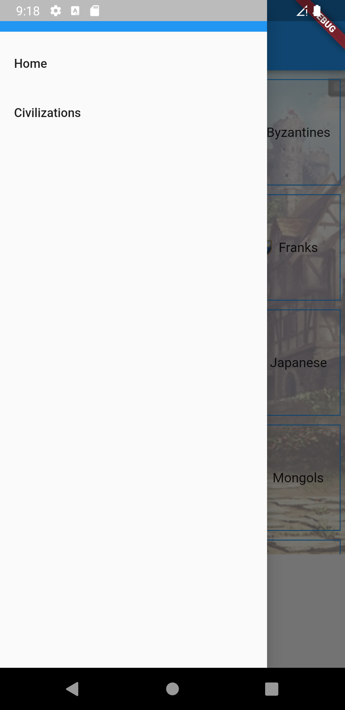

# Age of Empires 2's Information

This project was based on an API that purchases Age of Empires 2's units, structures, technologies and civilizations. Its main purpose was for studying how to use and call APIs from Dart/Flutter.

As you can see on the images bellow, the first screen gives us information about the API, who developed and where it is being hosted. The second image illustrates the menu.

<div>


</div>

If you click on "Civilizations"'s button on the menu, you will be redirect to the screen illustrated in the first image bellow. It gives us a list of every civilization that you can play on Age of Empires 2. The second image illustrates a screen when you click on one of the civilizations.

<div>


</div>

## How to get its code

This project was developed using:
- Flutter
- Dart
- Visual Studio Code
- Flutter Public Package:
    - URL Launcher
    - DIO
    - HTTP
    - HTML

To download this project and make changes, you can use the script bellow:

```
git clone https://github.com/nagaoka-thiago/age_of_empires_info.git
```